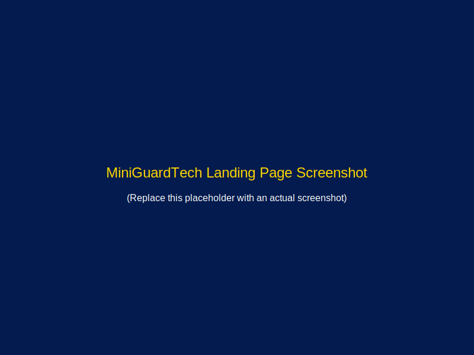

# MiniGuardTech Landing Page

A modern, responsive landing page for MiniGuardTech - a cybersecurity business that provides protection for small businesses.



## Features

- 🎨 Modern, responsive design
- 🌓 Dark/light mode with user preference detection
- ⚡ Vue 3 with TypeScript for type safety
- 🎯 TailwindCSS v4 for styling
- 📱 Mobile-first approach
- 📝 Form validation with client-side processing
- 💬 PepoForm integration for lead collection
- 🚀 Production-ready with Terser minification
- 🔒 Cybersecurity-focused components and sections

## Tech Stack

- Vue 3 (with Composition API + TypeScript)
- Vite for fast development and building
- Tailwind CSS v4
- Lucide Vue for icons
- PepoForm for form submissions
- Terser for JavaScript minification

## Project Structure

```
/
├── public/             # Static assets
│   └── favicon.svg     # Site favicon
├── src/
│   ├── assets/         # Project assets
│   ├── components/     # Vue components
│   │   ├── NavBar.vue
│   │   ├── HeroSection.vue
│   │   ├── ServicesSection.vue
│   │   ├── PlanCard.vue
│   │   ├── PlansSection.vue
│   │   ├── ContactForm.vue
│   │   └── FooterSection.vue
│   ├── App.vue         # Main app component
│   ├── main.ts         # App entry point
│   └── style.css       # Global styles
└── index.html          # HTML template
```

## Getting Started

### Installation

```bash
# Clone the repository
git clone https://github.com/yourusername/miniguardtech-landing.git

# Navigate into the directory
cd miniguardtech-landing

# Install dependencies
npm install
```

### Development

```bash
# Start development server
npm run dev
```

### Building for Production

```bash
# Build for production
npm run build

# Preview production build
npm run preview
```

## Customization

### Tailwind Configuration

Tailwind CSS is configured in the `tailwind.config.js` file. The site uses a custom color palette with navy blue and gold as primary colors.

### Dark Mode

The site uses Tailwind's `dark` class strategy with user preference detection and local storage saving.

### Form Integration with PepoForm

The contact form is integrated with PepoForm for lead collection. To configure your form:

1. Sign up for a [PepoForm](https://pepoform.com/) account
2. Create a new form and copy your form ID
3. Replace the placeholder in `ContactForm.vue`:
   ```js
   const PEPOFORM_ENDPOINT = "https://submit-form.com/your-pepoform-id";
   ```

## Image Optimization

The project includes an image optimization script that uses Sharp to create responsive images in multiple formats (WebP, AVIF, and original format). Run it with:

```bash
# Install dependencies if needed
npm install

# Run the image optimization script
npm run optimize-images
```

This will process all images in the `public/images` directory and create optimized versions in multiple sizes in the `public/images/optimized` directory.

For manual optimization, you can also use tools like [Squoosh](https://squoosh.app/) or [TinyPNG](https://tinypng.com/).

## License

[MIT](LICENSE)

## Credits

- Design and development by MiniGuardTech Team
- Icons by [Lucide Vue](https://lucide.dev/)
